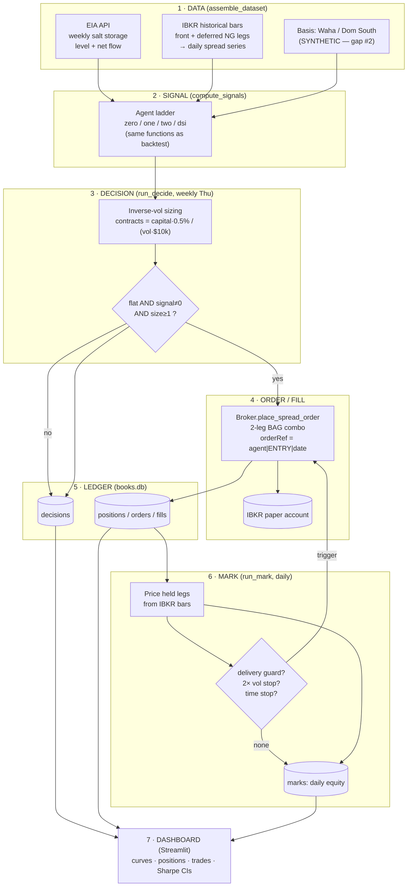
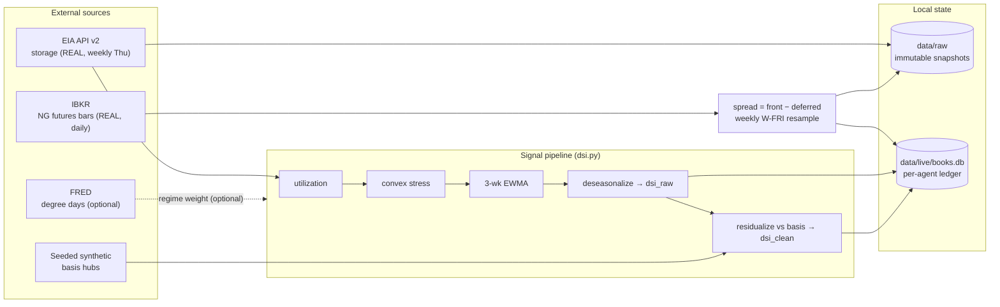
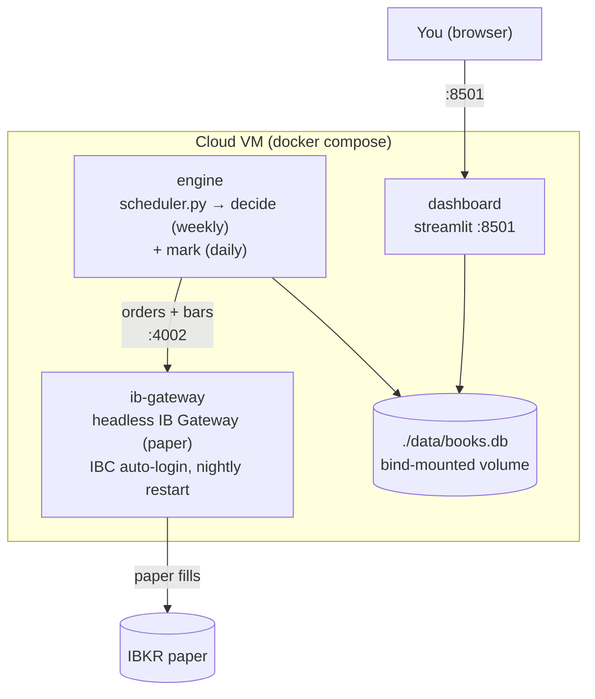

# LIVE PAPER-TRADING FRAMEWORK — Per-Agent Books on IBKR

*How the always-on, four-agent paper-trading system operates end to end, the
data pipeline behind it, the gaps that remain, and how to deploy and monitor it.*

This document is the operator's map. Pair it with `docs/strategy.md` (the frozen
strategy) and `docs/SPRINT_PLANNER.md` (the build timeline).

---

## 1. The experiment: an information ladder

Four agents trade the **same** NYMEX Henry Hub calendar spread through the
**same** execution path. Each rung adds exactly one more piece of information
to the signal, so the performance gap between adjacent rungs isolates the value
of that one piece — the entire point of the project.

| Book | Signal input | Adds over previous rung | Code |
|------|-------------|-------------------------|------|
| `agent_zero` | Weekly coin flip | — (null benchmark; proves the plumbing) | `agents.agent_zero` |
| `agent_one` | 5y z-score of raw salt net storage flow | **Real EIA storage data** | `agents.agent_one` |
| `agent_two` | z-score of `dsi_raw` (utilization → convex stress → 3-wk EWMA → deseasonalized) | **Normalization + convexity + smoothing + seasonal removal** | `agents.agent_two` |
| `agent_dsi` | z-score of `dsi_clean` + vol regime gate | **Basis residualization + volatility gating** | `agents.agent_dsi` |

Read the gaps: **One − Zero** = does real storage data beat noise? **Two − One**
= do the stress transform and deseasonalization help? **DSI − Two** = does
residualizing against basis and gating on volatility help? Each is a
pre-registered question the live books answer trade by trade.

Every agent has its own **virtual $100k book**. They share one IBKR paper
account (paper accounts have no sub-accounts), so separation is enforced in
software — see §4.

---

## 2. End-to-end flow (per agent)



**Decision job** (`run_decide`, weekly Thursday after the EIA print + NYMEX
settle): assembles data, computes every agent's signal for the latest weekly
bar, and **always** records a `decisions` row — including *why* it did or did
not trade. If an agent is flat and its signal fires with size ≥ 1 contract, it
routes a tagged combo order and opens a ledger position.

**Mark job** (`run_mark`, every weekday after settle): prices each open position
off fresh IBKR bars, checks exit rules, exits via a tagged opposite combo when
triggered, and writes a daily `marks` row (equity = capital + realized +
unrealized) for **every** agent — flat books included, so equity curves are
continuous and a missing row means "the job didn't run," not "nothing happened."

---

## 3. General data pipeline



Cadence summary:

| Feed | Source | Reality | Frequency | Used by |
|------|--------|---------|-----------|---------|
| Salt storage level/flow | EIA API v2 `natural-gas/stor/wkly` | **REAL** | Weekly (Thu) | all signal agents |
| NG spread (front − deferred) | IBKR historical bars | **REAL** | Daily | sizing, marks, DSI gate |
| Waha / Dom South basis | seeded synthetic RNG | **SYNTHETIC** | Weekly | agent_dsi residualization |
| Degree days | FRED (if key) / synthetic | optional | Weekly | regime weight (not yet in live sizing) |

---

## 4. How per-agent performance stays separate

One paper account, four books. Separation has three layers:

1. **Order tagging** — every order carries `orderRef = "<agent>|<ENTRY|EXIT>|<date>"`
   (`broker.place_spread_order`). Every fill in the shared account is therefore
   attributable to exactly one agent — the reconciliation trail inside IBKR.
2. **The ledger** (`data/live/books.db`, SQLite/WAL) is the **source of truth**.
   Per agent it records: `decisions` (every weekly evaluation with z / gate /
   season / size / reason), `orders`, `fills`, `positions` (≤1 open), `trades`
   (completed round trips with P&L + exit reason), and `marks` (daily equity).
   The account's blended NetLiq is **never** used for performance.
3. **Virtual capital** — each book's equity is computed off its own $100k base
   plus its own realized + unrealized P&L, using the exact P&L convention of
   `simulate()` in the backtest, so live and backtest numbers are comparable.

---

## 5. Data pipeline gaps

| # | Gap | Status today | Resolution path |
|---|-----|--------------|-----------------|
| 1 | **Live spread + vol** — EIA discontinued RNGC1/RNGC2 futures settles on 2024-04-05 | **RESOLVED** — live spread now comes from IBKR historical bars for the actual traded legs (`broker.spread_series`) | — |
| 2 | **Waha / Dom South basis** for DSI residualization | **RESOLVED (with a documented approximation)** — real Datastream regional hub quotes via the WRDS R2 mirror: `NATGWTX` (West Texas ≈ Permian/Waha) and `NATGAPP` (Appalachia ≈ Dom South), each minus `NGHHSNL` (Henry Hub Day-Ahead). ~2,280 daily obs each, 2017 → present. | See §5a below for the search that ruled out every alternative, the proxy caveat, and the winsorization. |
| 3 | **Backtest futures history + instrument mismatch** | **RESOLVED** — the backtest now trades the true seasonal spread built from 577 individual NYMEX NG contracts (`tr_ds_fut`), extending coverage from 2024-04-05 to **2026-04-03** (+2 years, 378 → 482 weekly obs). See §5b. |
| 4 | Salt max cycling rate = 90 Bcf/wk | Illustrative constant in `settings.yaml` | Refresh annually from EIA Form 191 (manual; non-blocking). |
| 5 | Degree-day regime weight | FRED key optional; weight not yet applied in live sizing | Add a free FRED key, or ship with regime weight fixed at 1.0 (a [0.5,1.0] size scalar, not a signal — non-blocking). |
| 6 | IBKR market-data entitlement | Delayed data configured (`reqMarketDataType(4)`) | Sufficient: decisions are weekly on daily bars. Verify NYMEX permissions on the paper account. |

The build is fully operational on real storage, real IBKR spread data, and
real regional basis. The remaining material gap is #3 (futures history
2024-04 → present), which truncates the backtest window.

### 5a. Basis: what we searched, what we found, what we settled on

**The true Waha and Dominion South pricing points are not obtainable free.**
This was established by exhaustive search, not assumption:

| Source | Result |
|--------|--------|
| EIA API v2 (all `natural-gas/pri/*` routes) | ❌ Only **state-level** city-gate / wellhead / sector prices (53 areas, all US states). No trading hubs. Henry Hub spot (`RNGWHHD`) is live daily to present; futures `RNGC1-4` died 2024-04-05. |
| IBKR (`reqMatchingSymbols` across the full product DB) | ❌ No gas basis futures on this account. Searches for "Waha"/"Dominion South" returned only equities/funds/bonds. |
| WRDS R2 — `doe_all` | ❌ **The catalog mis-describes this schema.** It is documented as "US DOE/EIA energy price and production data" but actually contains AMEX market-maker/specialist records (`partic, mktctr, mcname, exch`) — exchange microstructure, not Department of Energy. |
| WRDS R2 — `tr_ds_comds` (Datastream) | ✅ **Usable.** 969 `NATGAS` series; a "Natural Gas, `<region>`" family quoted in **$/MMBtu** (trading convention) rather than $/MCF (regulated-delivery convention). |
| ICE / NGI / Platts | ✅ Would carry the exact hubs — enterprise-priced. |

**What we use** (`connectivity.DATASTREAM_HUB_SERIES`):

```
waha_basis      = NATGWTX (Natural Gas, West Texas)      - NGHHSNL (Henry Hub Day-Ahead)
domsouth_basis  = NATGAPP (Natural Gas, Appalachia Avg)  - NGHHSNL
```

Basis *is* by definition `regional hub price − Henry Hub`, so this computes
basis from its components rather than substituting something unrelated.

**Validation** — the means are economically correct:
`waha` mean **−$1.22**/MMBtu (Permian discount, historically −$0.50 to −$2.00);
`domsouth` mean **−$0.72** (Appalachian glut discount). The two series
correlate at only **−0.08**, i.e. they are effectively independent controls —
Permian basis is driven by oil-associated-gas takeaway, Appalachian by
pipeline egress.

**Caveat (important):** these are regional **averages**, not the specific Waha
and Dominion South pricing points. The resulting basis tracks the real series
closely but not identically. This is a deliberate, documented approximation.

**Winsorization:** basis is clipped to ±$10/MMBtu (`BASIS_CLIP_USD`). Physical
gas markets produce genuine extremes — Winter Storm Uri (Feb 2021) drove raw
Waha basis above **+$174** — and because `residualize_against_basis` runs
rolling OLS on *first differences*, one such spike creates ±172 diffs that
corrupt coefficients for the entire 3-year window. Clipping preserves
direction and the "this was extreme" signal while preventing one crisis week
from dominating a decade of regressions. It mirrors the pipeline's existing
convention of clipping utilization to ±1.2. In practice this touches 15 of
2,290 Waha observations and 1 of 2,276 Dom South.

**Staleness:** the R2 mirror is a periodic snapshot (last sync 2026-06-30), not
a live feed. `regional_basis` returns `.attrs['last_date']` so callers can
detect and flag staleness rather than silently trading on old data.

### 5b. The instrument mismatch (fixed) — and what it revealed

**The problem.** The locked strategy trades a *seasonal* spread: front vs
**next January** in injection season (Apr–Oct), front vs **next April** in
withdrawal (Nov–Mar). The live engine does exactly that. The backtest did not:
it used EIA's `RNGC1 − RNGC2`, the **adjacent-month** spread — because EIA only
publishes four contracts out, while a seasonal deferred leg can be **nine**
months out. Backtest and live were measuring different instruments.

**How different:** the seasonal spread's weekly volatility is **0.272** vs
**0.104** for adjacent-month — **2.6× higher**. Every sizing, stop, and Sharpe
figure from the old backtest was calibrated on the wrong instrument.

**The fix** (`data/futures.py`): build the spread from individual NYMEX contract
settlements in `tr_ds_fut` — `wrds_contract_info` (futcode, `contrdate`
delivery month, `lasttrddate`) joined to `dsfutcontrval` (daily settlement).
577 NG contracts spanning 1990–2038.

Crucially, front/deferred month selection and the 5-business-day delivery guard
are **imported from `execution.contracts`** — the same pure functions the live
engine calls. There is one implementation of the rule, so backtest and live
cannot drift apart.

Verified correct: March observations → April front → next **January** deferred;
October → November front → next **April** deferred; boundary months (Feb, Sep)
correctly show both as the front rolls across the season line. Sample row
2026-03-26: front `2026-05` @ $2.93, deferred `2027-01` @ $5.18 — the classic
winter-premium shape. Contract-level provenance for every observation is written
to `data/raw/ng_seasonal_spread_contracts.csv`.

**Results on the correct instrument** (482 weekly obs, 2017-01-13 → 2026-04-03):

| Agent | Trades | Total ret | Max DD | Sharpe | 90% CI |
|-------|--------|-----------|--------|--------|--------|
| agent_zero | 154 | −28.7% | −36.3% | −0.55 | [−0.94, −0.08] |
| agent_one | 30 | −21.1% | −21.1% | −0.93 | [−1.20, −0.61] |
| agent_two | 14 | −13.6% | −13.6% | −0.74 | [−0.97, −0.57] |
| agent_dsi | 6 | **−1.7%** | **−1.8%** | −0.58 | [−0.84, −0.26] |

Two things changed materially versus the adjacent-month backtest:

1. **Every CI now EXCLUDES zero — and all are negative.** Previously they all
   spanned zero (inconclusive). On the instrument actually traded, with two
   extra years of data, the strategy loses money *significantly*. This is a
   genuine, statistically supported negative result, not an ambiguous one.
2. **The information ladder works, monotonically.** Ordered by total return:
   zero −28.7% → one −21.1% → two −13.6% → dsi −1.7%. **Each additional piece
   of information reduces losses.** That is precisely the effect the ladder was
   built to detect — it just operates on a strategy that is unprofitable
   overall, so more information means *less bad* rather than profitable.

**Caveat on Sharpe for the sparse agents:** `agent_dsi` trades 6 times in nine
years, so its weekly return series is mostly zeros punctuated by a few moves.
Sharpe is unstable and misleading in that regime — its −1.7% total return and
−1.8% drawdown are far more informative than its −0.58 Sharpe. Compare agents
on total return and drawdown here, not Sharpe.

**Cost note:** `agent_zero`'s 154 round trips at 4 leg-charges × 1 tick × $10
each account for a substantial share of its −28.7%. Trading frequently on a
wide seasonal spread is expensive, which is itself a finding.

**Effect on results:** switching from synthetic to real basis moved
`agent_dsi` from Sharpe −0.42 → −0.28 and its max drawdown from −5.9% → −4.2%
(`agent_two`: −0.57 → −0.46). Encouraging in direction, but **not evidence of
edge**: all Sharpes remain negative, all CIs span zero, and trade counts
(6–24 over seven years) are far too small to support inference. Note also that
the comparison is not a clean A/B — real basis changes `build_dsi().dropna()`'s
index, which shifts every agent's evaluation window, including agents that
don't use basis at all.

---

## 6. Deployment (runs with your computer off)

Three containers on one small always-on VM (Oracle Cloud always-free ARM shape
fits; or ~$5/mo Hetzner/DigitalOcean; ~1–2 GB RAM is plenty).



Bring-up:

```bash
# on the VM
git clone <repo> && cd storage-stress
cp .env.example .env         # fill TWS_USERID / TWS_PASSWORD (paper) + EIA_API_KEY
#                              and set IBKR_HOST=ib-gateway
docker compose up -d --build
# dashboard at http://<vm-ip>:8501
```

Why this shape:
- The **gateway** auto-logs-in and restarts nightly on its own; the engine's
  connection retries (`live.yaml ibkr.connect_retries`) absorb that window.
- The **scheduler** is a plain 60-second Python loop reading `live.yaml`
  (identical on Windows dev and Linux VM; no cron config to port). It runs each
  job as a subprocess, so an engine crash never kills the scheduler.
- `./data` is a bind-mounted volume, so `books.db` and logs survive rebuilds
  and can be copied off the VM for end-of-summer analysis.
- All jobs are **idempotent** (ledger writes are `INSERT OR REPLACE` / uniqued),
  so a retried run after a restart is harmless.

Local run without Docker (dev / laptop):

```bash
pip install -e ".[live,dashboard]"
# start IB Gateway (paper) locally, then:
python scripts/run_agents.py --job decide     # weekly
python scripts/run_agents.py --job mark        # daily
python scripts/run_agents.py --job status      # ledger snapshot, no broker needed
python scripts/scheduler.py                    # or run the loop directly
streamlit run dashboard/app.py                 # the dashboard
```

---

## 7. Monitoring & tracking

- **Dashboard** (`dashboard/app.py`): side-by-side equity curves and drawdowns,
  open positions with live unrealized P&L, the full trade history with exit
  reasons and per-trade P&L, weekly signal/decision history per agent, and the
  comparison view — rolling Sharpe per agent plus paired bootstrap Sharpe-
  difference CIs between adjacent rungs (reuses `bootstrap_sharpe_ci`), which is
  the "does the extra information help" chart.
- **Terminal**: `python scripts/run_agents.py --job status` prints each book's
  equity / realized P&L / open position / trade count without touching IBKR.
- **Logs**: `data/live/logs/<job>-<date>.log`, one file per job run.
- **Health signal**: a missing daily `marks` row for an agent means the mark
  job didn't run that day — investigate the gateway/scheduler, not the strategy.

---

## 8. Verification status

- `pytest` — 14 tests pass: seasonal calendar math + delivery guard
  (`contracts.py`), full ledger lifecycle + idempotency (`books.py`), exit-rule
  priority (`marks.py`), and `agent_two` behavior.
- Broker/engine integration is verified by a **live smoke run** against the
  paper gateway (place one small combo, confirm the fill reconciles and a
  ledger position opens), not by unit tests — mocking `ib_async` would only
  test the mock.
